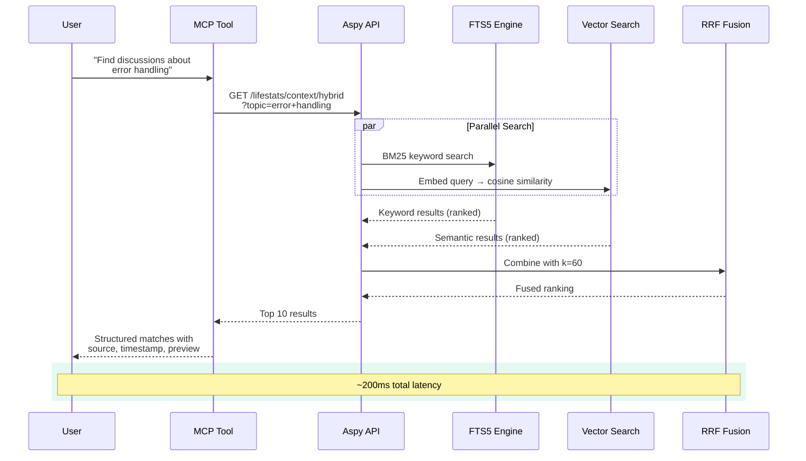
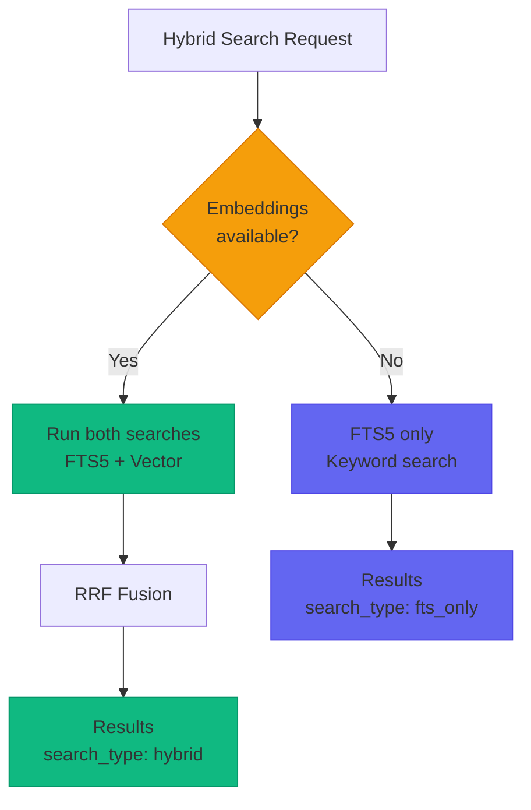

With [lifestats](/blog/2025/12/remembering-what-claude-forgot/), I shipped SQLite storage with FTS5 full-text search. It was a huge improvement over the jq archaeology workflow. Queries that took minutes now took milliseconds.

But something was off.

I'd search for "auth" and miss the conversation where I discussed "login flow." I'd search for "error handling" and not find the session about "exception strategy." The words were different. The *meaning* was the same.

FTS5 is literal. It finds what you said, not what you meant.

## The Keyword Problem

Here's a real example. I wanted to find a past discussion about streaming responses. The actual conversation used "SSE," "server-sent events," and "chunked transfer." I searched for "streaming."

Zero results.

```mermaid
graph LR
    Q[Search: streaming] --> FTS[FTS5 Engine]
    FTS --> M{Match?}
    M -->|No| R1[❌ SSE discussion]
    M -->|No| R2[❌ chunked transfer]
    M -->|No| R3[❌ server-sent events]

    style Q fill:#3f3f46,stroke:#71717a
    style FTS fill:#6366f1,stroke:#4f46e5
    style R1 fill:#ef4444,stroke:#dc2626,color:#fff
    style R2 fill:#ef4444,stroke:#dc2626,color:#fff
    style R3 fill:#ef4444,stroke:#dc2626,color:#fff
```


<p style="text-align: center; font-size: 0.9em; color: #a1a1aa; margin-top: -10px;"><em>Keyword search fails when terminology varies</em></p>

The information existed. The search couldn't find it.

This is the fundamental limitation of keyword search. It operates on surface-level token matching. If the exact word isn't there, it's invisible—no matter how conceptually related the content might be.

## Enter Embeddings

The solution is to search by *meaning*, not by words. That's what embeddings do.

An embedding model converts text into a high-dimensional vector—a list of numbers that represents the semantic meaning of that text. Similar meanings produce similar vectors. "Streaming," "SSE," and "server-sent events" all land in roughly the same region of vector space.

```mermaid
graph TB
    subgraph "Text Space (Words)"
        T1["streaming"]
        T2["SSE"]
        T3["server-sent events"]
        T4["authentication"]
    end

    subgraph "Vector Space (Meaning)"
        V1["[0.82, -0.31, 0.44, ...]"]
        V2["[0.79, -0.28, 0.41, ...]"]
        V3["[0.81, -0.33, 0.42, ...]"]
        V4["[-0.12, 0.67, -0.55, ...]"]
    end

    T1 -->|embed| V1
    T2 -->|embed| V2
    T3 -->|embed| V3
    T4 -->|embed| V4

    V1 <-.->|similar| V2
    V2 <-.->|similar| V3
    V1 <-.->|similar| V3

    style T1 fill:#3f3f46,stroke:#71717a
    style T2 fill:#3f3f46,stroke:#71717a
    style T3 fill:#3f3f46,stroke:#71717a
    style T4 fill:#27272a,stroke:#52525b
    style V1 fill:#8b5cf6,stroke:#6366f1
    style V2 fill:#8b5cf6,stroke:#6366f1
    style V3 fill:#8b5cf6,stroke:#6366f1
    style V4 fill:#27272a,stroke:#52525b
```


<p style="text-align: center; font-size: 0.9em; color: #a1a1aa; margin-top: -10px;"><em>Embeddings map different words with similar meanings to nearby vectors</em></p>

When I search for "streaming," the query gets embedded too. Then it's just geometry—find the stored vectors closest to the query vector. Cosine similarity. Dot products. Math that doesn't care about exact word matches.

## The Architecture

I added an embedding indexer that runs as a background task. It polls the lifestats database for unembedded content, batches it up, sends it to an embedding provider, and stores the resulting vectors.

```mermaid
graph TB
    subgraph "Background Indexer"
        POLL[Poll Timer] -->|every 30s| CHECK[Check for<br/>unembedded docs]
        CHECK -->|batch of 10| EMB[Embedding Provider]
        EMB -->|vectors| STORE[Store in SQLite]
    end

    subgraph "Embedding Providers"
        EMB --> OPENAI[OpenAI API<br/>text-embedding-3-small]
        EMB --> AZURE[Azure OpenAI]
        EMB --> OLLAMA[Ollama<br/>nomic-embed-text]
        EMB --> LOCAL[Local MiniLM<br/>all-MiniLM-L6-v2]
    end

    subgraph "Storage"
        STORE --> TE[(thinking_embeddings)]
        STORE --> PE[(prompts_embeddings)]
        STORE --> RE[(responses_embeddings)]
    end

    style POLL fill:#27272a,stroke:#52525b
    style CHECK fill:#3f3f46,stroke:#71717a
    style EMB fill:#8b5cf6,stroke:#6366f1
    style STORE fill:#10b981,stroke:#059669
    style OPENAI fill:#27272a,stroke:#52525b
    style AZURE fill:#27272a,stroke:#52525b
    style OLLAMA fill:#27272a,stroke:#52525b
    style LOCAL fill:#27272a,stroke:#52525b
```


<p style="text-align: center; font-size: 0.9em; color: #a1a1aa; margin-top: -10px;"><em>Background indexer converts text to vectors across multiple provider options</em></p>

The indexer is provider-agnostic. OpenAI's API, Azure OpenAI, Ollama running locally, or a compiled-in MiniLM model—same interface, same storage format. I can switch providers without re-architecting anything.

Configuration is straightforward:

```toml
[embeddings]
provider = "remote"
model = "text-embedding-3-small"
api_base = "https://api.openai.com/v1"
batch_size = 10
poll_interval_secs = 30
```

For the initial indexing run, I embedded roughly 1 million tokens of past session data. Cost: $0.02. Time: about 15 minutes with rate limiting. Not bad for a complete semantic index of everything I've ever discussed with Claude.

## But Keywords Still Matter

Here's the thing—semantic search isn't strictly *better* than keyword search. It's *different*.

Semantic search excels at conceptual queries: "discussions about error handling" finds content about exceptions, panics, Result types, and error propagation even if none of those exact words appear in your query.

But keyword search excels at precision: searching for `"unwrap()"` should find exactly that function call, not conceptually similar error handling patterns.

The ideal is both.

## Hybrid Search with RRF

This is where Reciprocal Rank Fusion comes in. RRF is an algorithm for combining ranked results from multiple search systems. It's elegantly simple:

For each document, calculate:
```
RRF_score = Σ (1 / (k + rank_i))
```

Where `k` is a constant (typically 60) and `rank_i` is the document's position in each result list. Documents that appear high in multiple lists get boosted. Documents that appear in only one list still contribute.

```mermaid
graph TB
    Q[Query: streaming responses] --> SPLIT{Split}

    SPLIT --> SEM[Semantic Search]
    SPLIT --> KW[Keyword Search<br/>FTS5 + BM25]

    SEM --> SR[Semantic Results<br/>1. SSE chunking<br/>2. Response streaming<br/>3. Async handlers]

    KW --> KR[Keyword Results<br/>1. Response streaming<br/>2. HTTP responses<br/>3. Response parsing]

    SR --> RRF[RRF Fusion]
    KR --> RRF

    RRF --> FINAL[Final Ranking<br/>1. Response streaming ⬆️<br/>2. SSE chunking<br/>3. HTTP responses<br/>4. Async handlers<br/>5. Response parsing]

    style Q fill:#3f3f46,stroke:#71717a
    style SEM fill:#8b5cf6,stroke:#6366f1
    style KW fill:#6366f1,stroke:#4f46e5
    style RRF fill:#10b981,stroke:#059669
    style FINAL fill:#10b981,stroke:#059669
```


<p style="text-align: center; font-size: 0.9em; color: #a1a1aa; margin-top: -10px;"><em>RRF combines semantic and keyword results—documents in both lists rise to the top</em></p>

"Response streaming" appears in both result sets, so RRF boosts it to the top. "SSE chunking" only appears in semantic results but still makes the final list. The fusion captures both the conceptual matches and the literal ones.

## BM25: The Keyword Side

On the keyword side, I'm using BM25 through SQLite's FTS5. BM25 (Best Match 25) is a ranking function that improves on simple term frequency by accounting for:

- **Term frequency saturation**: The first occurrence of a word matters more than the tenth
- **Document length normalization**: Short documents with a keyword aren't unfairly penalized against long documents
- **Inverse document frequency**: Rare words are more significant than common ones

```mermaid
graph LR
    subgraph "BM25 Scoring"
        TF[Term Frequency<br/>How often in doc?] --> SAT[Saturation<br/>Diminishing returns]
        IDF[Inverse Doc Freq<br/>How rare overall?] --> WEIGHT[Word Weight]
        DL[Doc Length<br/>Normalize for size] --> NORM[Length Norm]

        SAT --> SCORE[BM25 Score]
        WEIGHT --> SCORE
        NORM --> SCORE
    end

    style TF fill:#3f3f46,stroke:#71717a
    style IDF fill:#3f3f46,stroke:#71717a
    style DL fill:#3f3f46,stroke:#71717a
    style SCORE fill:#6366f1,stroke:#4f46e5
```


<p style="text-align: center; font-size: 0.9em; color: #a1a1aa; margin-top: -10px;"><em>BM25 balances term frequency, rarity, and document length</em></p>

FTS5 handles all of this automatically. I just query with `bm25()` ranking and get relevance-sorted results.

```sql
SELECT content, bm25(thinking_fts) as score
FROM thinking_fts
WHERE thinking_fts MATCH 'streaming'
ORDER BY score
LIMIT 10;
```

Lower scores are better (it's a distance metric). The results come back ranked by relevance, not just presence.

## The Full Pipeline

Here's how it all fits together at query time:


<p style="text-align: center; font-size: 0.9em; color: #a1a1aa; margin-top: -10px;"><em>Hybrid search executes keyword and semantic queries in parallel, then fuses results</em></p>

Both searches run in parallel. FTS5 queries the full-text index. The vector search embeds the query and finds nearest neighbors. RRF merges them. The whole thing takes about 200ms.

## Graceful Degradation

Not everyone wants to pay for embeddings. Not everyone has an OpenAI API key. The system handles this gracefully:


<p style="text-align: center; font-size: 0.9em; color: #a1a1aa; margin-top: -10px;"><em>No embeddings? System falls back to FTS-only with clear indication</em></p>

The response includes `search_type: "hybrid"` or `search_type: "fts_only"` so Claude knows what kind of search was performed. If embeddings aren't configured or haven't finished indexing, keyword search still works. You lose the semantic matching but keep the core functionality.

## Real Impact

Back to the streaming example. With hybrid search:

```
Query: "streaming"

Results:
1. [thinking] "For streaming responses, I need to tee the SSE stream..."
2. [thinking] "The chunked transfer encoding handles backpressure..."
3. [response] "Server-sent events flow through the proxy..."
```

The exact phrase "streaming" might not appear in any of these. But the *concept* of streaming does. Semantic search found what I meant.

This is the difference between a search engine and a memory. Search engines find documents. Memory recalls ideas.

## What's Next

The embedding system opens up possibilities I haven't fully explored yet:

- **Clustering**: Group similar discussions automatically
- **Anomaly detection**: Surface unusual patterns in Claude's behavior
- **Cross-session linking**: Find related conversations across months of history
- **Summarization triggers**: Auto-summarize when themes recur

For now, hybrid search is the immediate win. When Claude loses context to compaction, it can query not just what I said, but what I meant. The vocabulary mismatch problem is solved.

The spy doesn't just remember what you said. It remembers what you meant.

---

## Appendix: The Numbers

For the curious, here are the actual costs and dimensions:

| Provider | Model | Dimensions | Cost per 1M tokens |
|----------|-------|------------|-------------------|
| OpenAI | text-embedding-3-small | 1536 | $0.02 |
| OpenAI | text-embedding-3-large | 3072 | $0.13 |
| Azure OpenAI | text-embedding-3-small | 1536 | $0.02 |
| Ollama | nomic-embed-text | 768 | Free (local) |
| Local | all-MiniLM-L6-v2 | 384 | Free (compiled in) |

Higher dimensions generally mean more nuanced semantic capture, but 1536 dimensions is plenty for context recovery. I'm using `text-embedding-3-small` and it handles everything I've thrown at it.

Storage overhead is roughly 6KB per embedded document (1536 floats × 4 bytes). For my ~5000 documents, that's about 30MB of vector storage. Negligible.

The real cost is API calls during initial indexing. After that, it's just new content as it arrives—a few cents per day of active usage.

