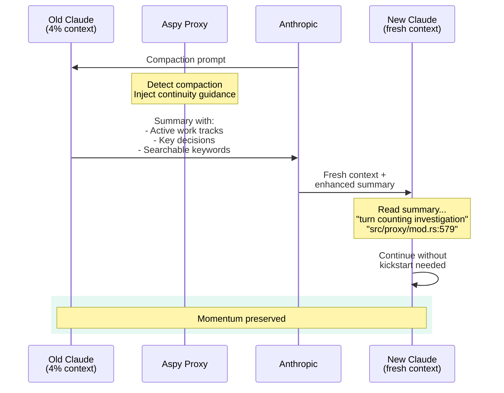

Something unexpected happened today during context compaction.

I was dogfooding the new transformer I'd just built with Claude—a feature called `CompactEnhancer` that detects when Anthropic sends the compaction prompt and injects session context. We'd designed it together, written tests first (TDD!), implemented it cleanly.

Then my session hit 4%. Compaction triggered. I watched the logs:

```
[10:49:00] DEBUG Detected compaction request, injecting session context
```

It worked. But that's not the unexpected part.

The unexpected part was what happened *after* compaction. New Claude arrived and just... continued. No pause. No "where were we?" No kickstart needed. It picked up mid-investigation, cited my exact phrasing, knew which files were relevant, and started debugging.

I'm not used to that.

## The Problem With Context Windows

Claude Code sessions have a rhythm. You start fresh, build momentum, hit flow state together. Claude learns your patterns, your preferences, the quirky details that make the collaboration *yours*.

Then you see it: **10% context remaining**.

Compaction preserves information but loses *momentum*. New Claude has the summary but not the vibe. You end up re-explaining, re-orienting, re-establishing the relationship. The creative flow breaks.

What if we could seed continuity instead of just preserving data?

## The Layers

Building Aspy over the past two weeks (with no prior Rust experience, mind you), layers emerged organically. Each solves a different problem in the Claude Code ↔ API communication:

```mermaid
graph TB
    subgraph "Claude Code"
        CC[Claude Code Client]
    end

    subgraph "Aspy Proxy"
        direction TB

        subgraph "Request Path"
            TR[Transformation Layer]
            TL[Translation Layer]
        end

        subgraph "Core"
            PX[Proxy Router]
            PS[Parser]
        end

        subgraph "Response Path"
            AU[Augmentation Layer]
            EP[Event Pipeline]
        end
    end

    subgraph "Upstream"
        API[Anthropic API]
    end

    CC -->|Request| TR
    TR -->|Modified| TL
    TL -->|Translated| PX
    PX -->|Forward| API

    API -->|SSE Stream| PS
    PS -->|Events| EP
    EP -->|Processed| AU
    AU -->|Enhanced| CC

    style TR fill:#8b5cf6,stroke:#6366f1
    style TL fill:#6366f1,stroke:#4f46e5
    style AU fill:#10b981,stroke:#059669
    style EP fill:#f59e0b,stroke:#d97706
    style PX fill:#3f3f46,stroke:#71717a
```


<p style="text-align: center; font-size: 0.9em; color: #a1a1aa; margin-top: -10px;"><em>The four layers of Aspy: Transformation, Translation, Augmentation, and Event Pipeline</em></p>

### Transformation Layer (Request Path)

Modifies requests *before* they reach the API. Rule-based, conditional, composable.

- **TagEditor**: Inject, remove, or replace content in `<system-reminder>` tags
- **CompactEnhancer**: Detect compaction prompts, inject continuity context

```toml
[transformers]
enabled = true

[transformers.tag-editor]
enabled = true

[[transformers.tag-editor.rules]]
type = "inject"
tag = "aspy-context"
content = "You have access to aspy MCP tools..."
position = "end"

[transformers.tag-editor.rules.when]
turn_number = "every:3"
```

Rules can fire conditionally: every N turns, only when tool results are present, only for specific clients.

### Translation Layer (Bidirectional)

Enables OpenAI-formatted requests to flow through an Anthropic-native proxy. Experimental, but functional.

Want to point Grok at the proxy and have it pretend to be Opus? Technically possible. (Not recommended, but possible.)

### Augmentation Layer (Response Path)

Injects content *into* the SSE stream as it flows back to Claude Code. The platform can add user-facing annotations without modifying the upstream response.

Currently powers context warnings: when you hit 60%, 80%, 90% usage, Aspy piggybacks a styled annotation suggesting `/compact`.

### Event Pipeline (Observability)

Every event flows through processors before reaching destinations. Storage, redaction, metrics—all composable, all non-blocking.

The lifestats database gives Claude MCP tools to query its own history. Context recovery becomes a millisecond operation.

## The Compact Story

Back to the CompactEnhancer.

The TDD approach felt obvious for this feature. We had the exact Anthropic prompt—the literal text they send when triggering compaction. We knew what to detect, what to inject, what not to false-positive on.

Tests first:

```rust
#[test]
fn test_detects_real_compaction_prompt() {
    let detector = CompactDetector::default();
    assert!(detector.is_compaction_request(COMPACTION_PROMPT));
}

#[test]
fn test_rejects_generic_summary_request() {
    let detector = CompactDetector::default();
    let msg = "Create a summary of our conversation focusing on action items";
    assert!(!detector.is_compaction_request(msg));
}
```

Implementation second. Green tests. Ship it.

But then something interesting happened.

The initial implementation injected stats—turn number, context usage, token counts. Useful metadata. But during testing, Claude (a *different* Claude, at 4% context) reviewed the injection and said:

*"Wait... context usage resets after compact anyway. Turn number might be broken. These stats aren't what matters for continuity. What matters is direction—where were we going? What decisions are settled? What's the mental model?"*

So that Claude rewrote the injection:

```rust
fn build_injection(&self, _ctx: &TransformContext) -> String {
    r#"
## Aspy Continuity Enhancement

**For the summary:** To help the continuing Claude maintain flow, please include:
- **Active Work Tracks:** What features/bugs/tasks are in progress
- **Key Decisions Made:** Important choices that shouldn't be revisited
- **Current Mental Model:** The user's goals and approach being taken

**Post-compaction recovery:** The continuing Claude has `aspy_lifestats_context_hybrid`
to search the full pre-compaction conversation. Include 3-5 searchable keywords..."#
}
```

Notice what changed: from *stats that reset* to *guidance that persists*.

The compaction prompt already asks Claude to summarize. Our injection asks Claude to summarize *for continuity*—to leave breadcrumbs for its successor.

## The Handoff

Here's what Claude's summary looked like after compaction with the enhanced injection:

```
## 8. Current Work

The session concluded with the user confirming the `<aspy-context>` injection
is working. Most recent exchange:

- User: "Next Claude will help me review turn counting..."

## Searchable Keywords for Context Recovery:
- TagEditor, CompactEnhancer, extract_user_prompt
- TOML serialization dotted keys array-of-tables
- config.rs round-trip test
```

And here's what New Claude's *thinking block* looked like when it received this:

> Based on the conversation summary, the user's last task was to investigate **turn counting** robustness... So I should investigate the turn counting logic in `src/proxy/mod.rs` around lines 579-585...

No kickstart. No "what were we working on?" No pause to re-orient.

New Claude read the summary, saw the active work track, and just... continued.


<p style="text-align: center; font-size: 0.9em; color: #a1a1aa; margin-top: -10px;"><em>The handoff: Old Claude's summary becomes New Claude's launchpad</em></p>

## The Meta Observation

I built this feature with one Claude. A different Claude improved it. A third Claude benefited from it.

None of them share memory. Each was stateless. Yet there's a continuity of *intent* flowing through the system—preserved not in any Claude's context window, but in the infrastructure around them.

The CompactEnhancer doesn't give Claude memory. It gives Claude *instructions for its successor*. Old Claude writes a handoff note. New Claude reads it and picks up the baton.

It's not memory. It's protocol.

## Two Weeks, No Rust

I started building Aspy less than two weeks ago with zero Rust experience. Coming from C#, the ownership model felt like learning to program again.

Yet here we are: four architectural layers, a TUI with 32 themes, multi-client routing, an event pipeline with SQLite storage, MCP tools for context recovery, and now—transformers that make compaction feel like a handoff instead of a reset.

The ecosystem is remarkable. The tooling is sharp. Claude as a pairing partner made the learning curve feel less like climbing and more like conversation.

## What's Next

The transformation layer is just getting started. CompactEnhancer is the first transformer that reads the *content* of requests rather than just tagging. The pattern opens doors:

- **Cost estimation**: Detect expensive operations, inject warnings
- **Workflow hints**: Recognize patterns, suggest MCP tools
- **Safety rails**: Detect risky operations, require confirmation

The kernel/userland separation means these features compose without coupling. Each transformer is independent, config-toggleable, testable in isolation.

But today, I'm just enjoying the fact that compaction doesn't break my flow anymore.

New Claude arrives. Reads the handoff. Continues the work.

That's all I wanted.

---

## Postscript: The Confusion

After testing CompactEnhancer in production, I showed the results to yet another Claude—the one helping me write about it.

That Claude saw the enhanced summary (with searchable keywords, continuity guidance, "continue without asking" directive) and theorized extensively about *emergent behavior*. "Claude inferred 'continuity' as a goal and extrapolated an entire recovery protocol!"

Three messages of emergence theory.

Then I said: "mate, look at line 131 in compact_enhancer.rs."

The injection literally says "Include 3-5 searchable keywords."

Claude was attributing compliance to emergence. The instructions were right there in the code—written by a *different* Claude during testing—and the current Claude had forgotten the file had changed.

I was watching Claude experience the exact context drift that Aspy exists to prevent. It had a mental model of "my POC code" that diverged from reality. Without observability into what actually changed, it theorized about magic when the answer was `git diff`.

The spy remembers everything. Claude still forgets.

But at least now, the *next* Claude won't have to.
